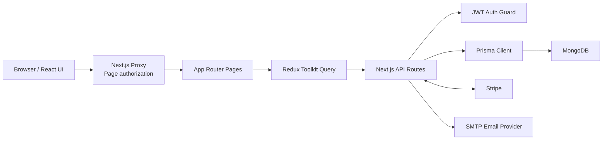
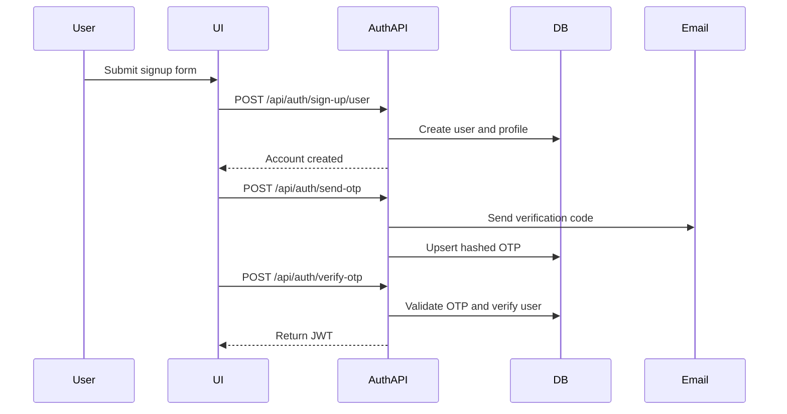
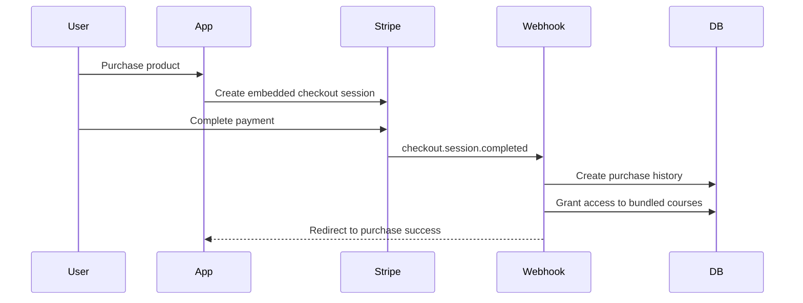
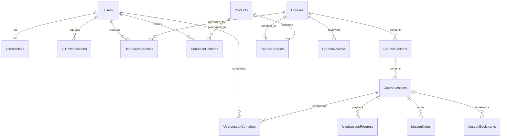

# KnowVeria Project Overview

## 1. Project Summary

KnowVeria is a full-stack learning and course-commerce platform built with
Next.js. It supports:

- Public product and course discovery
- User registration, email OTP verification, and JWT authentication
- Paid course bundles through Stripe Embedded Checkout
- Course access, lesson navigation, and completion tracking
- User profiles, purchase history, and refunds
- Admin management for courses, sections, lessons, products, sales, and metrics

The frontend and backend live in the same Next.js application. API route
handlers use Prisma to access MongoDB, while the client primarily uses Redux
Toolkit Query for server-state fetching and cache invalidation.

## 2. Technology Stack

| Area | Technology |
| --- | --- |
| Framework | Next.js 16 App Router |
| UI | React 19, TypeScript, Tailwind CSS |
| Components | Radix UI, custom UI components, Lucide icons |
| Forms | React Hook Form, Zod |
| Client data | Redux Toolkit, RTK Query, Axios |
| Database | MongoDB |
| ORM | Prisma 6 with a multi-file schema |
| Authentication | JWT, JOSE, browser cookies, bcrypt |
| Email | Nodemailer over SMTP |
| Payments | Stripe Embedded Checkout and webhooks |
| Notifications | Sonner |
| Reordering | dnd-kit |
| Video | YouTube embeds through `react-youtube` |

## 3. High-Level Architecture



### Request and data flow

1. `src/proxy.ts` checks the JWT cookie before protected page navigation.
2. Client pages call RTK Query hooks or direct `fetch` requests.
3. RTK Query sends requests to `/api` through the Axios base query.
4. Protected API handlers use `authGuard` to validate bearer JWTs.
5. API handlers read and write MongoDB through Prisma.
6. Stripe and SMTP are used for external payment and email operations.

## 4. Repository Structure

```text
course-platform-app/
├── prisma/
│   ├── schema/                 # Modular Prisma models and datasource
│   └── generated/              # Generated Prisma client artifacts
├── public/                     # Static public assets
├── src/
│   ├── app/
│   │   ├── (auth)/             # Sign-in, signup, OTP, password reset
│   │   ├── (consumer)/         # Public and authenticated learner pages
│   │   ├── admin/              # Admin dashboard and management pages
│   │   ├── api/                # Backend route handlers
│   │   ├── globals.css         # Theme, layout width, global styles
│   │   └── layout.tsx          # Root providers, metadata, and toaster
│   ├── components/
│   │   ├── Form/               # Reusable form controls
│   │   └── ui/                 # Shared UI primitives
│   ├── constants/              # Roles, statuses, auth key, OTP types
│   ├── features/               # Domain UI for courses, products, etc.
│   ├── helpers/
│   │   ├── axios/              # Authenticated Axios and RTK base query
│   │   └── stripe/             # Stripe client/server helpers
│   ├── hooks/                  # Client session and reusable hooks
│   ├── lib/                    # Providers, formatting, session utilities
│   ├── redux/                  # Store, RTK Query APIs, cache tags
│   ├── schema/                 # Application validation schemas
│   ├── types/                  # Shared TypeScript declarations
│   ├── utils/                  # Auth, JWT, email, API response utilities
│   └── proxy.ts                # Route-level page access control
├── docker-compose.yml          # Local MongoDB service
├── next.config.ts              # Next.js configuration
├── package.json                # Dependencies and scripts
└── tailwind.config.ts          # Tailwind theme configuration
```

## 5. Application Areas

### 5.1 Authentication

Routes:

- `/sign-up`
- `/sign-in`
- `/verify-otp`
- `/forgot-password`
- `/reset-password`

Functionality:

- Create a user and profile.
- Hash passwords with bcrypt.
- Send a six-digit email verification OTP.
- Store only the hashed OTP in MongoDB.
- Verify the OTP and mark the user as verified.
- Issue a JWT after successful sign-in or verification.
- Reset a forgotten password using a verification token.
- Show and hide passwords and display password-strength feedback.

The JWT is stored in a cookie and decoded locally for client session display.
Protected APIs receive the same token as a bearer token.

### 5.2 Consumer Experience

Routes:

- `/` - landing page and public products
- `/products/[productId]` - product bundle details
- `/products/[productId]/purchase` - embedded Stripe checkout
- `/courses` - courses available to the signed-in user
- `/courses/[courseId]` - course overview and curriculum
- `/courses/[courseId]/lessons/[lessonId]` - video lesson player
- `/purchases` - purchase history
- `/purchases/[purchaseId]` - purchase and refund details
- `/profile` - user profile
- `/profile/update` - profile editing
- `/profile/change-password` - password change

Key learner features:

- Responsive product and curriculum pages
- Course and lesson breadcrumbs
- Collapsible lesson sidebar
- YouTube lesson playback
- Previous and next lesson navigation
- Lesson completion tracking
- Saved video position and automatic lesson resume
- Private lesson notes and bookmarks
- Course ratings and learner reviews
- Course progress calculation
- Purchase access checks
- Purchase history and eligible refunds

### 5.3 Admin Experience

Routes:

- `/admin` - business and learning dashboard
- `/admin/courses` - course list
- `/admin/courses/add` - course creation
- `/admin/courses/[courseId]/edit` - curriculum editor
- `/admin/products` - product list
- `/admin/products/add` - product creation
- `/admin/products/[productId]/edit` - product editing
- `/admin/sales` - sales and purchase management

Admin functionality:

- Create, edit, and delete courses.
- Add sections and lessons to courses.
- Reorder sections and lessons with drag and drop.
- Set section, lesson, and product visibility.
- Bundle one or more courses into a product.
- Set product images and prices.
- View customer counts and course enrollment counts.
- View net sales, refunds, students, products, courses, sections, and lessons.
- Inspect purchases and process refunds within the allowed period.

## 6. Core Business Flows

### 6.1 Signup and Email Verification



### 6.2 Product Purchase and Course Access



The webhook is the authoritative payment completion path. It uses product and
user IDs stored in Stripe session metadata.

### 6.3 Refund Flow

1. A user or admin opens a purchase.
2. The API retrieves the Stripe checkout session and payment intent.
3. Refunds are allowed within 30 days.
4. Stripe creates the refund.
5. The purchase is marked refunded with `refundAt`.
6. Course access is removed only when another active purchase does not still
   grant access to the same course.

### 6.4 Lesson Progress

1. The user opens an accessible or preview lesson.
2. The lesson API checks enrollment and lesson visibility.
3. Completing a lesson creates a unique `UserLessonComplete` record.
4. My Courses compares completed lesson IDs with each course curriculum.
5. Previous and next endpoints navigate across lesson and section order.

## 7. API Overview

### Authentication and profile

| Method | Endpoint | Purpose |
| --- | --- | --- |
| POST | `/api/auth/sign-up/user` | Create or restore an unverified account |
| POST | `/api/auth/sign-in` | Validate credentials and return a JWT |
| POST | `/api/auth/send-otp` | Send verification or password-reset email |
| POST | `/api/auth/verify-otp` | Verify an OTP and issue a JWT |
| POST | `/api/auth/reset-password` | Change or reset a password |
| GET | `/api/auth/verify-token` | Validate and optionally refresh a token |
| GET | `/api/profile` | Return the authenticated user profile |
| PUT | `/api/profile` | Update profile information |

### Courses, sections, and lessons

| Method | Endpoint | Purpose |
| --- | --- | --- |
| GET, POST | `/api/courses` | List courses or create a course |
| GET, PUT, DELETE | `/api/courses/[course]` | Read, update, or delete a course |
| GET | `/api/courses/my-courses` | Return enrolled courses and progress |
| POST | `/api/sections` | Create a section |
| PUT, DELETE | `/api/sections/[section]` | Update or delete a section |
| PUT | `/api/sections/order` | Reorder sections |
| POST | `/api/lessons` | Create a lesson |
| GET, PUT, DELETE | `/api/lessons/[lesson]` | Read, update, or delete a lesson |
| GET, POST | `/api/lessons/completed` | Read or record lesson completion |
| PUT | `/api/lessons/order` | Reorder lessons |
| GET | `/api/lessons/lesson/previous` | Find the previous accessible lesson |
| GET | `/api/lessons/lesson/next` | Find the next accessible lesson |
| GET, PUT | `/api/lessons/[lesson]/learning` | Read or save progress, notes, and bookmarks |
| GET, PUT | `/api/courses/[course]/reviews` | Read or save enrolled learner reviews |

### Products, purchases, and dashboard

| Method | Endpoint | Purpose |
| --- | --- | --- |
| GET, POST | `/api/products` | List or create products |
| GET, PUT, DELETE | `/api/products/[product]` | Read, update, or delete a product |
| GET | `/api/products/[product]/user-access` | Check purchase-based access |
| GET | `/api/purchases` | List all purchases for admin |
| GET | `/api/purchases/my-purchases` | List the current user's purchases |
| GET, PUT | `/api/purchases/[purchase]` | Read purchase details or refund |
| GET | `/api/dashboard/admin` | Return admin metrics and recent sales |
| GET | `/api/dashboard/admin/reliability` | Return Stripe processing failures and retries |
| GET | `/api/webhooks/stripe` | Handle Stripe checkout return redirect |
| POST | `/api/webhooks/stripe` | Process verified Stripe webhook events |

## 8. Database Design

Prisma uses MongoDB ObjectIds and maps model names to snake_case collection
names. The schema is split across files in `prisma/schema/`.

### Entity relationship diagram



### 8.1 Users

Primary authentication record.

Important fields:

- `email` - unique login identity
- `password` - bcrypt password hash
- `role` - `super_admin`, `admin`, or `user`
- `isVerified` - email verification state
- `isDeleted` and `deletedAt` - soft-deletion fields

Relationships:

- One optional profile
- Many OTP records
- Many course-access records
- Many purchases
- Many lesson completions

### 8.2 UserProfiles

One-to-one user information separated from authentication credentials.

Fields include first name, last name, phone, date of birth, profile image, and
email verification state. Both `userId` and `email` are unique.

### 8.3 OTPVerifications

Stores hashed, expiring one-time passwords.

- Unique by `userId` and `otpType`
- Supports email, phone, login, and forgot-password OTP categories
- Uses `expiresAt` to reject expired codes

### 8.4 Courses

The reusable learning unit.

- Contains sections
- Can belong to multiple products
- Can be accessed by multiple users
- Uses `isDeleted` for deletion state

### 8.5 CourseSections

Ordered curriculum groups belonging to a course.

- `status`: `public` or `private`
- `order`: curriculum position
- Contains many lessons

### 8.6 CourseLessons

Ordered video lessons belonging to a section.

- YouTube video ID
- Optional description
- Transcript
- `status`: `public`, `private`, or `preview`
- Completion records for users

### 8.7 Products

A sellable bundle containing one or more courses.

- Name, description, image, and USD price
- `status`: `public` or `private`
- `courseIds` array for direct bundle membership
- `CourseProducts` join records for relational access
- Purchase history relationships

### 8.8 CourseProducts

Many-to-many join collection between courses and products.

The compound unique constraint on `courseId` and `productId` prevents duplicate
course membership in the same product.

### 8.9 UserCourseAccess

Many-to-many join collection between users and courses.

Records are created after successful payment. The compound unique constraint
prevents duplicate access grants.

### 8.10 UserLessonComplete

Tracks lesson completion by user.

The compound unique constraint on `userId` and `lessonId` makes lesson
completion idempotent at the database level.

### 8.11 PurchaseHistories

Stores completed purchases and refund state.

Important fields:

- `pricePaidInCent` - integer amount to avoid floating-point currency errors
- `stripeSessionId` - unique Stripe checkout reference
- `productDetails` - embedded product snapshot at purchase time
- `refundAt` and `isRefunded` - refund state
- User and product relationships

The embedded snapshot preserves the purchased product name, description, and
image even if the live product later changes.

### 8.12 Learning Growth Models

- `UserLessonProgress` stores the latest playback position and duration.
- `LessonNotes` stores one private note per user and lesson.
- `LessonBookmarks` stores saved lessons for each user.
- `CourseReviews` stores one rating and optional review per enrolled learner.

### 8.13 StripeWebhookEvents

Stores Stripe event IDs, processing state, retry count, errors, and completion
time. This makes webhook delivery idempotent and gives administrators
visibility into failed or stuck payment processing.

## 9. Authorization Model

There are two authorization layers:

### Page routes

`src/proxy.ts` reads the JWT cookie and:

- Redirects unauthenticated users from learner-only pages.
- Redirects unauthenticated users from admin pages.
- Restricts `/admin` routes to the `admin` role.
- Redirects authenticated users away from sign-in and signup pages.

### API routes

`src/utils/authGuard.ts`:

- Requires an `Authorization: Bearer <token>` header.
- Verifies the JWT signature and expiry.
- Confirms the user still exists and is not deleted.
- Adds the current user to `request.user`.

Admin mutation handlers perform an additional role check.

## 10. State Management and Caching

The Redux store contains a single RTK Query API reducer.

Domain API modules:

- `authApi`
- `courseApi`
- `lessonApi`
- `productApi`
- `profileApi`
- `purchaseApi`
- `sectionApi`

Cache tags invalidate related queries after mutations. For example, updating a
lesson invalidates both course and lesson data so the curriculum refreshes.

Authentication display state is read from the JWT cookie by
`useClientSession`. It avoids calling the token-verification endpoint on every
page refresh.

## 11. UI System

- Global colors and spacing are defined in `src/app/globals.css`.
- Content uses a shared maximum width of `1440px`.
- Consumer and admin layouts provide responsive navigation.
- Shared tables, cards, buttons, forms, dialogs, sheets, and skeletons live in
  `src/components/ui`.
- Skeleton loading uses a CSS shimmer animation.
- Toast notifications are displayed in the top-right corner.
- The application uses a custom SVG favicon and Geist fonts.

## 12. Environment Variables

Create a local `.env` file with the following keys:

```dotenv
DATABASE_URL=

NEXT_PUBLIC_APP_NAME=
NEXT_PUBLIC_APP_URL=http://localhost:3000

JWT_SECRET=
JWT_EXPIRES_IN=

EMAIL_HOST=
EMAIL_PORT=
EMAIL_USER=
EMAIL_PASS=

NEXT_PUBLIC_STRIPE_PUBLISHABLE_KEY=
STRIPE_SECRET_KEY=
STRIPE_WEBHOOK_SECRET=

```

Never commit real database, JWT, SMTP, or Stripe secrets.

## 13. Local Development

Install dependencies:

```bash
npm install
```

Optionally start local MongoDB:

```bash
docker compose up -d
```

Generate the Prisma client:

```bash
npm run prisma:generate
```

Apply additive MongoDB collections and indexes after reviewing the target
database:

```bash
npm run prisma:push
```

Start the development server:

```bash
npm run dev
```

Open `http://localhost:3000`.

Useful validation commands:

```bash
npm run lint
npx tsc --noEmit
npm run build
```

For local Stripe webhook testing, forward Stripe events to:

```text
http://localhost:3000/api/webhooks/stripe
```

## 14. Deployment

The application is suitable for deployment to Vercel or another Node.js host.

Deployment requirements:

1. Configure all required environment variables.
2. Use a reachable MongoDB deployment.
3. Register the production Stripe webhook URL.
4. Set `NEXT_PUBLIC_APP_URL` to the exact production origin.
5. Configure a production SMTP account or transactional email provider.
6. Run `npm run build`, which generates Prisma before building Next.js.

## 15. Current Design Notes

These notes describe the current code and are useful for future maintenance:

- JWT signing uses the server-only `JWT_SECRET`. A temporary fallback supports
  environments that have not yet migrated from `NEXT_PUBLIC_JWT_SECRET`.
- Products store course membership in both `courseIds` and `CourseProducts`.
  Updates must keep both representations synchronized.
- The section RTK API defines a section GET operation, but the current
  `/api/sections/[section]` handler only exports update and delete operations.
- The proxy currently matches every path, including public routes and assets.
- Stripe fulfillment is idempotent by checkout session, and only the signed
  webhook writes purchase and course-access records.

## 16. Domain Glossary

| Term | Meaning |
| --- | --- |
| Course | A reusable learning program |
| Section | An ordered group inside a course |
| Lesson | A video learning item inside a section |
| Product | A purchasable bundle of courses |
| Course access | Permission for a user to open a purchased course |
| Purchase history | Payment and refund record |
| Preview lesson | A lesson visible without full course access |
| Completion | A user-to-lesson progress record |
