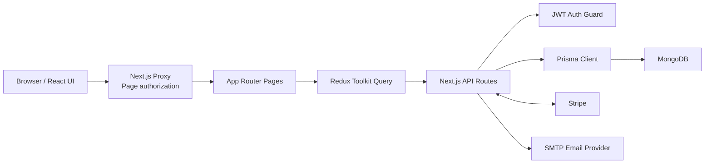
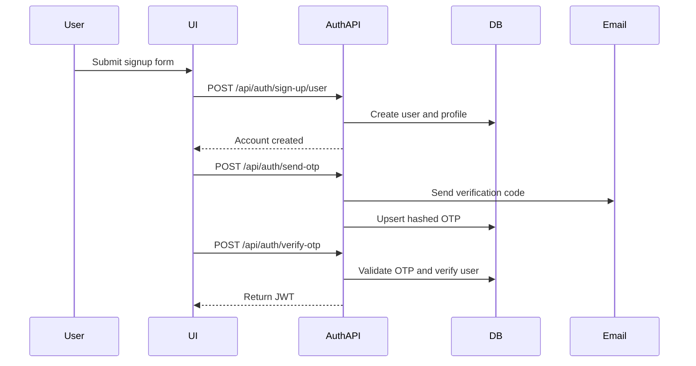
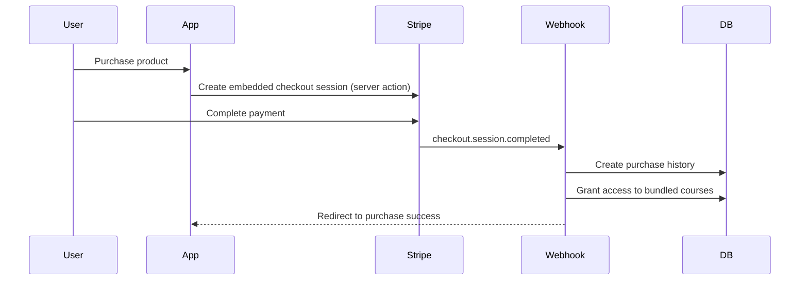
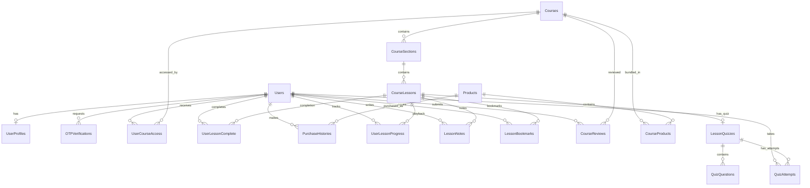

# KnowVeria Project Overview

## 1. Project Summary

KnowVeria is a full-stack learning and course-commerce platform built with Next.js 16 App Router. It supports:

- Public product and course discovery
- User registration, email OTP verification, and JWT authentication
- Paid course bundles through Stripe Embedded Checkout
- Course access, lesson navigation, and completion tracking
- Video, text, and quiz lesson types
- Private lesson notes, bookmarks, saved playback position, and automatic lesson resume
- Course reviews and ratings with update capability
- Graded quiz assessments with configurable grading strategies
- User profiles, purchase history, and refunds
- Admin management for courses, sections, lessons, products, sales, and metrics

The frontend and backend live in the same Next.js application. API route handlers use Prisma to access MongoDB, while the client primarily uses Redux Toolkit Query for server-state fetching and cache invalidation.

## 2. Technology Stack

| Area           | Technology                                             |
| -------------- | ------------------------------------------------------ |
| Framework      | Next.js 16 App Router                                  |
| UI             | React 19, TypeScript, Tailwind CSS                     |
| Components     | Radix UI, shadcn/ui primitives, Lucide icons           |
| Forms          | React Hook Form, Zod                                   |
| Client data    | Redux Toolkit, RTK Query, Axios                        |
| Database       | MongoDB                                                |
| ORM            | Prisma 6 with a multi-file schema                      |
| Authentication | JWT, JOSE, browser cookies, bcrypt                     |
| Email          | Nodemailer over SMTP                                   |
| Payments       | Stripe Embedded Checkout and webhooks                  |
| Notifications  | Sonner                                                 |
| Reordering     | dnd-kit                                                |
| Video          | YouTube embeds through `react-youtube`                 |
| Markdown       | Custom `MarkdownContent` renderer and `MarkdownEditor` |

## 3. High-Level Architecture



### Request and data flow

1. `src/proxy.ts` checks the JWT cookie before protected page navigation.
2. Client pages call RTK Query hooks or direct `fetch` requests.
3. RTK Query sends requests to `/api` through the Axios base query.
4. Protected API handlers use `authGuard` to validate bearer JWTs.
5. API handlers read and write MongoDB through Prisma.
6. Stripe and SMTP are used for external payment and email operations.

## 4. Repository Structure

```text
course-platform-app/
├── prisma/
│   ├── schema/                    # Modular Prisma models
│   │   ├── schema.prisma          # Generator and datasource config
│   │   ├── User.prisma            # Users, UserRole enum
│   │   ├── UserProfiles.prisma    # UserProfiles
│   │   ├── OTPVerifications.prisma# OTPVerifications, OTPType enum
│   │   ├── Courses.prisma         # Courses
│   │   ├── CourseSections.prisma  # CourseSections, CourseSectionStatus
│   │   ├── CourseLessons.prisma   # CourseLessons, CourseLessonStatus, CourseLessonType
│   │   ├── CourseProducts.prisma  # CourseProducts (many-to-many join)
│   │   ├── Products.prisma        # Products, ProductStatus
│   │   ├── PurchaseHistories.prisma# PurchaseHistories, ProductDetail type
│   │   ├── UserCourseAccess.prisma # UserCourseAccess
│   │   ├── UserLessonComplete.prisma # UserLessonComplete
│   │   ├── LearningGrowth.prisma  # UserLessonProgress, LessonNotes, LessonBookmarks, CourseReviews
│   │   ├── LessonQuizzes.prisma   # LessonQuizzes, QuizQuestions, QuizAttempts, enums
│   │   └── StripeWebhookEvents.prisma # StripeWebhookEvents, WebhookEventStatus
│   └── generated/                 # Generated Prisma client artifacts
├── public/                        # Static public assets
├── src/
│   ├── app/
│   │   ├── (auth)/                # Sign-in, signup, OTP, forgot/reset password
│   │   ├── (consumer)/            # Public and authenticated learner pages
│   │   ├── admin/                 # Admin dashboard and management pages
│   │   ├── api/                   # Backend route handlers
│   │   ├── globals.css            # Theme, layout width, global styles
│   │   ├── layout.tsx             # Root providers, metadata, and toaster
│   │   └── not-found.tsx          # Custom 404 page
│   ├── components/
│   │   ├── Form/                  # Reusable form controls (TextInput, SelectInput, etc.)
│   │   └── ui/                    # Shared UI primitives (button, card, dialog, table, etc.)
│   ├── constants/                 # Roles, statuses, auth key, OTP types
│   ├── features/                  # Domain UI for courses, products, purchases, sections, lessons
│   ├── helpers/
│   │   ├── axios/                 # Authenticated Axios and RTK base query
│   │   └── stripe/                # Stripe client/server helpers
│   ├── hooks/                     # Client session and reusable hooks
│   ├── lib/                       # Providers, formatting, Prisma client, session utilities
│   ├── redux/                     # Store, RTK Query APIs, cache tags
│   ├── schema/                    # Zod validation schemas (course, lesson, product, profile)
│   ├── types/                     # Shared TypeScript declarations
│   ├── utils/                     # Auth, JWT, email, API response utilities
│   └── proxy.ts                   # Route-level page access control
├── components.json                # shadcn/ui configuration
├── docker-compose.yml             # Local MongoDB service
├── next.config.ts                 # Next.js configuration
├── package.json                   # Dependencies and scripts
└── tailwind.config.ts             # Tailwind theme configuration
```

## 5. Application Areas

### 5.1 Authentication

Routes:

- `/sign-up`
- `/sign-in`
- `/verify-otp`
- `/forgot-password`
- `/reset-password`

Functionality:

- Create a user and profile.
- Hash passwords with bcrypt.
- Send a six-digit email verification OTP.
- Store only the hashed OTP in MongoDB.
- Verify the OTP and mark the user as verified.
- Issue a JWT after successful sign-in or verification.
- Reset a forgotten password using a verification token.
- Show and hide passwords and display password-strength feedback.
- Password reset and change flows with old/new password validation.

The JWT is stored in a cookie and decoded locally for client session display. Protected APIs receive the same token as a bearer token. The `useClientSession` hook reads the cookie to avoid calling the verification endpoint on every page refresh.

### 5.2 Consumer Experience

Routes:

- `/` — landing page and public products
- `/products/[productId]` — product bundle details
- `/products/[productId]/purchase` — embedded Stripe checkout
- `/products/[productId]/purchase/success` — purchase confirmation
- `/products/purchase-failure` — checkout failure landing
- `/products/purchase-pending` — delayed payment notification
- `/courses` — courses available to the signed-in user
- `/courses/[courseId]` — course overview and curriculum
- `/courses/[courseId]/lessons/[lessonId]` — video, text, or quiz lesson
- `/courses/[courseId]/lessons/[lessonId]/attempt/[attemptId]` — quiz attempt review
- `/bookmarks` — bookmarked lessons
- `/grades` — graded quiz and exam results per course
- `/purchases` — purchase history
- `/purchases/[purchaseId]` — purchase and refund details
- `/profile` — user profile
- `/profile/update` — profile editing
- `/profile/change-password` — password change

Key learner features:

- Responsive product and curriculum pages
- Course and lesson breadcrumbs
- Collapsible lesson sidebar with curriculum navigation
- Video, text, and quiz lesson type support
- YouTube lesson playback with saved position and automatic resume
- Previous and next lesson navigation across sections
- Lesson completion tracking with visual progress
- Private lesson notes with view, edit, and remove states
- Lesson bookmarks with toggle
- Course reviews and ratings with update capability
- Quiz lessons with single/multiple choice, true/false, and written answers
- Configurable quiz grading strategies (highest, latest, average, first attempt)
- Quiz attempt history, time limits, and max attempt controls
- Grade overview by course with summary metrics
- Course progress calculation
- Purchase access checks
- Purchase history and eligible refunds

### 5.3 Admin Experience

Routes:

- `/admin` — business and learning dashboard
- `/admin/courses` — course list with pagination and search
- `/admin/courses/add` — course creation
- `/admin/courses/[courseId]/edit` — curriculum editor with tabs
- `/admin/products` — product list with pagination and search
- `/admin/products/add` — product creation
- `/admin/products/[productId]/edit` — product editing
- `/admin/sales` — sales and purchase management with search, filters, and pagination

Admin functionality:

- Create, edit, and soft-delete (archive) courses, sections, and lessons.
- Add sections and lessons to courses.
- Reorder sections and lessons with drag and drop via dnd-kit.
- Set section, lesson, and product visibility (public, private, preview).
- Bundle one or more courses into a product.
- Set product images and prices.
- View student counts, course enrollment counts, and metrics.
- View net sales, refunds, students, products, courses, sections, and lessons.
- Inspect purchases and process refunds within the allowed period.
- Archive/restore and publish/unpublish products.
- Course curriculum editor with search, visibility filters, and accordion-based sections.
- Admin preview mode for viewing course content without purchasing.

## 6. Core Business Flows

### 6.1 Signup and Email Verification



### 6.2 Product Purchase and Course Access



The webhook is the authoritative payment completion path. It uses product and user IDs stored in Stripe session metadata. Stripe fulfillment is idempotent by checkout session — only the signed webhook writes purchase and course-access records. Webhook event IDs are stored and deduplicated in the `stripe_webhook_events` collection.

### 6.3 Refund Flow

1. A user or admin opens a purchase.
2. The API retrieves the Stripe checkout session and payment intent.
3. Refunds are allowed within 30 days using idempotency keys.
4. Stripe creates the refund.
5. The purchase is marked refunded with `refundAt`.
6. Course access is removed only when another active purchase does not still grant access to the same course.

### 6.4 Lesson Progress and Learning Tools

1. The user opens an accessible or preview lesson.
2. The lesson API checks enrollment and lesson visibility.
3. For video lessons, playback position is saved periodically via `saveLessonLearning`.
4. Completing a lesson creates a unique `UserLessonComplete` record (idempotent at the database level).
5. My Courses compares completed lesson IDs with each course curriculum.
6. Previous and next endpoints navigate across lesson and section order.
7. Users can save private notes and bookmark lessons via the learning tools panel.

### 6.5 Quiz Assessments

1. An admin configures a quiz with questions, passing score, grading strategy, and optional time/max-attempt limits.
2. A learner starts an attempt, answers questions, and submits.
3. Auto-graded question types (single_choice, multiple_choice, true_false, short_answer) score immediately.
4. Manual-grade questions (long_answer) enter a pending-review state.
5. The grade is calculated using the configured strategy (highest, latest, average, or first valid attempt).
6. Grades and attempt history are available on the Grades page, grouped by course.

## 7. API Overview

### Authentication and profile

| Method | Endpoint                   | Purpose                                                                                     |
| ------ | -------------------------- | ------------------------------------------------------------------------------------------- |
| POST   | `/api/auth/sign-up/user`   | Create or restore an unverified account                                                     |
| POST   | `/api/auth/sign-in`        | Validate credentials and return a JWT                                                       |
| POST   | `/api/auth/send-otp`       | Send verification or password-reset email                                                   |
| POST   | `/api/auth/verify-otp`     | Verify an OTP and issue a JWT                                                               |
| POST   | `/api/auth/reset-password` | Change or reset a password (supports `change_password` and `forgot_password` request types) |
| GET    | `/api/auth/verify-token`   | Validate and optionally refresh a token                                                     |
| GET    | `/api/profile`             | Return the authenticated user profile with purchase and access data                         |
| PUT    | `/api/profile`             | Update profile (firstName, lastName, imageUrl) and return a refreshed JWT                   |

### Courses, sections, and lessons

| Method                | Endpoint                              | Purpose                                                        |
| --------------------- | ------------------------------------- | -------------------------------------------------------------- |
| GET, POST             | `/api/courses`                        | List courses (with pagination and search) or create a course   |
| GET, PUT, DELETE      | `/api/courses/[course]`               | Read (with access checks), update, or delete a course          |
| POST                  | `/api/sections`                       | Create a section                                               |
| PUT, DELETE           | `/api/sections/[section]`             | Update or delete a section                                     |
| PUT                   | `/api/sections/order`                 | Reorder sections                                               |
| POST                  | `/api/lessons`                        | Create a lesson                                                |
| GET, PUT, DELETE      | `/api/lessons/[lesson]`               | Read (with access checks), update, or delete a lesson          |
| GET, POST             | `/api/lessons/completed`              | Read completed lesson IDs or mark a lesson as complete         |
| PUT                   | `/api/lessons/order`                  | Reorder lessons                                                |
| GET                   | `/api/lessons/lesson/previous`        | Find the previous accessible lesson                            |
| GET                   | `/api/lessons/lesson/next`            | Find the next accessible lesson                                |
| GET, PUT              | `/api/lessons/[lesson]/learning`      | Read or save progress (position, viewed), notes, and bookmarks |
| GET, PUT, POST, PATCH | `/api/lessons/[lesson]/quiz`          | Read, save quiz config, submit answers, or start an attempt    |
| POST, GET, PATCH      | `/api/lessons/[lesson]/quiz/attempt`  | Start, read, save, or finish a quiz attempt                    |
| GET, PATCH            | `/api/lessons/[lesson]/quiz/attempts` | Read pending attempts or grade an instructor-graded attempt    |
| GET, PUT              | `/api/courses/[course]/reviews`       | Read (with user review) or save/update a course review         |

### Learning and grades

| Method      | Endpoint                  | Purpose                                                              |
| ----------- | ------------------------- | -------------------------------------------------------------------- |
| GET, DELETE | `/api/learning/bookmarks` | List or remove the current user's bookmarked lessons                 |
| GET         | `/api/learning/grades`    | Return all graded assessments grouped by course with attempt history |

### Products, purchases, and dashboard

| Method           | Endpoint                              | Purpose                                                                                                              |
| ---------------- | ------------------------------------- | -------------------------------------------------------------------------------------------------------------------- |
| GET, POST        | `/api/products`                       | List (paginated, searchable, filterable by status/archive) or create products                                        |
| GET, PUT, DELETE | `/api/products/[product]`             | Read, update, or delete/archive a product                                                                            |
| GET              | `/api/products/[product]/user-access` | Check whether the user has purchased this product                                                                    |
| GET              | `/api/purchases`                      | List all purchases (paginated, searchable, filterable by status)                                                     |
| GET              | `/api/purchases/my-purchases`         | List the current user's purchases                                                                                    |
| GET, PUT         | `/api/purchases/[purchase]`           | Read purchase details or process a refund                                                                            |
| GET              | `/api/dashboard/admin`                | Return admin metrics (net sales, refunds, counts of students/products/courses/sections/lessons) and recent purchases |
| GET              | `/api/dashboard/admin/reliability`    | Return Stripe webhook processing failures and stale processing events                                                |
| GET              | `/api/webhooks/stripe`                | Handle Stripe checkout return redirect                                                                               |
| POST             | `/api/webhooks/stripe`                | Process verified Stripe webhook events (idempotent by event ID)                                                      |

## 8. Database Design

Prisma uses MongoDB ObjectIds and maps model names to snake_case collection names. The schema is split across 14 files in `prisma/schema/`.

### Entity relationship diagram



### 8.1 Users

Primary authentication record.

Important fields:

- `email` — unique login identity
- `password` — bcrypt password hash
- `role` — `super_admin`, `admin`, or `user`
- `isVerified` — email verification state
- `isDeleted` and `deletedAt` — soft-deletion fields

Relationships:

- One optional profile
- Many OTP records
- Many course-access records
- Many purchases
- Many lesson completions
- Many progress, note, bookmark, and review records
- Many quiz attempts

### 8.2 UserProfiles

One-to-one user information separated from authentication credentials.

Fields include first name, last name, phone, date of birth, profile image (`imageUrl`), and email verification state. Both `userId` and `email` are unique.

### 8.3 OTPVerifications

Stores hashed, expiring one-time passwords.

- Unique by `userId` and `otpType`
- Supports email, phone, login, and forgot-password OTP categories
- Uses `expiresAt` to reject expired codes

### 8.4 Courses

The reusable learning unit.

- Contains sections via `CourseSections`
- Can belong to multiple products via `CourseProducts`
- Can be accessed by multiple users via `UserCourseAccess`
- Uses `isDeleted` for deletion state

### 8.5 CourseSections

Ordered curriculum groups belonging to a course.

- `status`: `public` or `private`
- `order`: curriculum position
- Contains many lessons via `CourseLessons`

### 8.6 CourseLessons

Ordered learning items belonging to a section.

- `type`: `video`, `text`, or `quiz`
- YouTube video ID (for video lessons)
- `content` field (for text/reading lessons)
- Optional description, transcript
- `status`: `public`, `private`, or `preview`
- One optional `LessonQuizzes` record

### 8.7 LessonQuizzes

A quiz attached to a lesson. Only one quiz per lesson.

- `kind`: `quiz` or `exam`
- `passingScore`: percentage required to pass
- `gradeStrategy`: `highest`, `latest`, `average`, or `first`
- `isGradable`: marks assessments that produce grades
- `isPublished`: visibility control
- Optional `timeLimitMinutes` and `maxAttempts`
- Optional `availableFrom` and `availableUntil` windows
- Contains `QuizQuestions` and `QuizAttempts`

### 8.8 QuizQuestions

Ordered questions belonging to a quiz.

- `type`: `single_choice`, `multiple_choice`, `true_false`, `short_answer`, or `long_answer`
- `options`: answer choices for choice-based types
- `correctOption` / `correctOptions`: correct answer(s)
- `acceptedAnswers` / `caseSensitive`: manual matching for short_answer
- `points`: point value for scoring
- `explanation`: shown after answering

### 8.9 QuizAttempts

Tracks a user's attempt at a quiz.

- `status`: `in_progress`, `submitted`, `timed_out`, `pending_review`, or `graded`
- `score`: auto-calculated score percentage
- `passed`: whether score meets passing threshold
- `earnedPoints` / `totalPoints`: point-based scoring
- `responses` / `grading`: JSON fields for response data and manual grading
- `feedback`: optional instructor feedback
- `startedAt`, `submittedAt`, `gradedAt`, `expiresAt`: timing fields

### 8.10 Products

A sellable bundle containing one or more courses.

- Name, description, image, and USD price
- `status`: `public` or `private`
- `courseIds` array for direct bundle membership
- `CourseProducts` join records for relational integrity

### 8.11 CourseProducts

Many-to-many join collection between courses and products.

The compound unique constraint on `courseId` and `productId` prevents duplicate course membership in the same product.

### 8.12 UserCourseAccess

Many-to-many join collection between users and courses.

Records are created after successful payment. The compound unique constraint prevents duplicate access grants.

### 8.13 UserLessonComplete

Tracks lesson completion by user.

The compound unique constraint on `userId` and `lessonId` makes lesson completion idempotent at the database level.

### 8.14 PurchaseHistories

Stores completed purchases and refund state.

Important fields:

- `pricePaidInCent` — integer amount to avoid floating-point currency errors
- `stripeSessionId` — unique Stripe checkout reference
- `productDetails` — embedded `ProductDetail` type (name, description, imageUrls) preserving the purchased product snapshot
- `refundAt` and `isRefunded` — refund state
- User and product relationships

### 8.15 Learning Growth Models

- `UserLessonProgress` stores the latest playback position and duration per user-lesson pair.
- `LessonNotes` stores one private note per user and lesson with view, edit, and remove.
- `LessonBookmarks` stores saved lessons for each user.
- `CourseReviews` stores one rating and optional review per enrolled learner, with update support.

### 8.16 StripeWebhookEvents

Stores Stripe event IDs, processing state (`processing`, `processed`, `failed`), retry count, errors, and completion time. This makes webhook delivery idempotent and gives administrators visibility into failed or stuck payment processing through the dashboard reliability panel.

## 9. Authorization Model

There are two authorization layers:

### Page routes

`src/proxy.ts` reads the JWT cookie and matches paths using regex-based route matchers:

- **Public routes:** `/`, `/sign-in(.*)`, `/sign-up(.*)`, `/verify-email(.*)`, `/forgot-password(.*)`, `/reset-password(.*)`, `/api(.*)`, lesson pages, product pages
- **Auth-restricted routes (redirect if authenticated):** sign-in, sign-up, verify-email, forgot-password, reset-password
- **Admin routes (redirect if not admin):** `/admin(.*)`
- **User routes (redirect if not authenticated):** `/profile(.*)`, `/purchases(.*)`, `/courses(.*)`, purchase flow pages

The middleware runs on all paths via `config.matcher = "/:path*"`.

### API routes

`src/utils/authGuard.ts`:

- Requires an `Authorization: Bearer <token>` header.
- Verifies the JWT signature and expiry using JOSE.
- Confirms the user still exists and is not deleted.
- Adds the current user to `request.user`.

Admin mutation handlers perform an additional role check using `isAdminRole()` from constants.

## 10. State Management and Caching

The Redux store contains a single RTK Query API reducer with 11 cache tag types:

`auth`, `course`, `section`, `lesson`, `product`, `purchases`, `profile`, `completedLesson`, `lessonLearning`, `courseReview`, `lessonQuiz`

Domain API modules in `src/redux/api/`:

- `authApi`
- `courseApi`
- `lessonApi` (includes completed lessons, learning tools, quizzes, previous/next navigation)
- `productApi` (includes user access checks)
- `profileApi`
- `purchaseApi`
- `sectionApi`
- `learningApi` (bookmarks and grades)
- `baseApi` (root Axios base query configuration)

Cache tags invalidate related queries after mutations. For example, updating a lesson invalidates both course and lesson data so the curriculum refreshes.

Authentication display state is read from the JWT cookie by `useClientSession`. It avoids calling the token-verification endpoint on every page refresh.

## 11. UI System

### Design system

- Global colors, spacing, and layout widths are defined in `src/app/globals.css`.
  - Content uses a shared maximum width of `1440px` (`--content-max-width`).
  - Primary color: indigo-based (HSL 238 72% 58%).
  - Accent color: sky-blue (HSL 199 89% 48%).
  - Radius: `0.75rem` (12px) with smaller variants.
  - Background features subtle radial gradients for visual depth.
- Tailwind CSS with `tailwindcss-animate` plugin for Radix UI animations.
- Class-variance-authority (`cva`) and `tailwind-merge` for component variants.
- Three reusable page containers: `.layout-container` (navbar), `.page-shell` (full pages with responsive padding), `.container` (utility).

### Component architecture

- **UI primitives** (`src/components/ui/`): button, card, dialog, dropdown-menu, sheet, table, tabs, accordion, badge, input, textarea, select, popover, skeleton, separator, avatar, command, menubar, label, form wrappers.
- **Form controls** (`src/components/Form/`): `Form`, `TextInput`, `SelectInput`, `MultiSelectInput`, `TextAreaInput`, `PasswordInput`, `PasswordStrength`.
- **Navigation**: `AppNavbar` (responsive with mobile sheet drawer), `ProfileMenu`, `PageHeader`.
- **Admin editor**: `SortableList`, `SortableSectionList`, `SortableLessonList` with dnd-kit, `SectionFormDialog`, `LessonFormDialog`, `LessonQuizEditor`, `QuizGradingPanel`, `QuizAttempt` review.
- **Skeleton loading**: CSS shimmer animation via `.skeleton-shimmer` class, `Skeleton` component, `SkeletonText`, `SkeletonButton`, and `TableSkeleton` for complex loading states.
- **Notifications**: Sonner toaster in the top-right corner with success/error loading states.

### Navigation styling

The navigation system uses a consistent styling pattern throughout:

- **Desktop navbar links**: `text-sm font-medium`, active state with `bg-primary/10 font-semibold text-primary`
- **Mobile navbar links**: `text-sm font-medium tracking-tight` with icons and sheet-based drawer
- **Profile sidebar links**: `text-sm font-medium` with icons, active state with `bg-primary/10 font-semibold text-primary`
- **Shared primitives**: All active/hover states use `bg-primary/10` (10% opacity) for consistency

## 12. Environment Variables

Create a local `.env` file with the following keys:

```dotenv
DATABASE_URL=

NEXT_PUBLIC_APP_NAME=
NEXT_PUBLIC_APP_URL=http://localhost:3000

JWT_SECRET=
JWT_EXPIRES_IN=

EMAIL_HOST=
EMAIL_PORT=
EMAIL_USER=
EMAIL_PASS=

NEXT_PUBLIC_STRIPE_PUBLISHABLE_KEY=
STRIPE_SECRET_KEY=
STRIPE_WEBHOOK_SECRET=

```

A legacy `NEXT_PUBLIC_JWT_SECRET` fallback exists for environments that have not yet migrated to the server-only `JWT_SECRET`.

Never commit real database, JWT, SMTP, or Stripe secrets.

## 13. Local Development

Install dependencies:

```bash
npm install
```

Optionally start local MongoDB:

```bash
docker compose up -d
```

Generate the Prisma client:

```bash
npm run prisma:generate
```

Apply additive MongoDB collections and indexes after reviewing the target
database:

```bash
npm run prisma:push
```

Start the development server:

```bash
npm run dev
```

Open `http://localhost:3000`.

Useful validation commands:

```bash
npm run lint
npx tsc --noEmit
npm run build
```

For local Stripe webhook testing, forward Stripe events to:

```text
http://localhost:3000/api/webhooks/stripe
```

## 14. Deployment

The application is suitable for deployment to Vercel or another Node.js host.

Deployment requirements:

1. Configure all required environment variables.
2. Use a reachable MongoDB deployment.
3. Register the production Stripe webhook URL.
4. Set `NEXT_PUBLIC_APP_URL` to the exact production origin.
5. Configure a production SMTP account or transactional email provider.
6. Run `npm run build`, which generates Prisma before building Next.js.

The build process (`npm run build`) runs `prisma generate` before `next build` to ensure the Prisma client is available during the build step.

## 15. Current Design Notes

These notes describe the current code and are useful for future maintenance:

- JWT signing uses the server-only `JWT_SECRET`. A temporary fallback supports environments that have not yet migrated from `NEXT_PUBLIC_JWT_SECRET`.
- Products store course membership in both `courseIds` and `CourseProducts`. Updates must keep both representations synchronized. Choosing one source of truth is tracked in the production roadmap.
- The proxy middleware currently matches every path (`/:path*`), including public routes and assets. It correctly handles redirects for auth-required pages.
- Stripe fulfillment is idempotent by checkout session. Only the signed webhook writes purchase and course-access records. Webhook events are stored and deduplicated in the `stripe_webhook_events` collection.
- The webhook return redirect (`GET /api/webhooks/stripe`) reads the checkout session from Stripe and redirects to a success or pending page based on payment status.
- Lesson types are `video`, `text`, and `quiz`, with separate rendering paths in the lesson player.
- Quiz assessments support five question types with auto and manual grading, configurable grading strategies, and attempt history.
- Course reviews allow one review per enrolled user with update support.
- Profile data uses `imageUrl` in both the Prisma model and API — the frontend type annotation should match.
- Tailwind container utility is configured with a max-width of 1440px (via `screens.sm`) and responsive padding (1rem / 1.5rem / 2rem).
- The `overrides` field in `package.json` pins several transitive dependency versions to address CVEs reported by package audits.
- Prisma 6 is pinned for MongoDB compatibility. Prisma 7 does not currently support MongoDB, so upgrades require careful consideration.

## 16. Known Production Readiness Status

The project has a detailed production readiness roadmap (`PRODUCTION_ROADMAP.md`) organized into five phases:

| Phase      | Focus                                                                                              | Status                                                                      |
| ---------- | -------------------------------------------------------------------------------------------------- | --------------------------------------------------------------------------- |
| Foundation | Core stability, dependency upgrades, CI, responsive UI, webhook idempotency, admin UX improvements | ✅ Completed                                                                |
| Phase 1    | Security (httpOnly cookies, CSRF, rate limiting, audit log)                                        | Not started                                                                 |
| Phase 2    | Data reliability (payment reconciliation, backups)                                                 | Mostly completed                                                            |
| Phase 3    | Testing (unit, integration, E2E) and operations (monitoring, alerts)                               | Not started                                                                 |
| Phase 4    | Business essentials (coupons, invoices, analytics, exports)                                        | Not started                                                                 |
| Phase 5    | Learning product growth (certificates, announcements, accessibility)                               | Partially completed (quizzes, text lessons, notes, bookmarks, reviews done) |

## 17. Domain Glossary

| Term              | Meaning                                                                                    |
| ----------------- | ------------------------------------------------------------------------------------------ |
| Course            | A reusable learning program containing sections                                            |
| Section           | An ordered group of lessons inside a course                                                |
| Lesson            | A learning item inside a section (video, text, or quiz)                                    |
| Product           | A purchasable bundle of courses                                                            |
| Course access     | Permission for a user to open a purchased course                                           |
| Purchase history  | Payment and refund record                                                                  |
| Preview lesson    | A lesson visible without full course access                                                |
| Completion        | A user-to-lesson progress record                                                           |
| Quiz              | An assessment lesson with multiple question types                                          |
| Attempt           | A single submission of a quiz by a user                                                    |
| Grade strategy    | The method for calculating the final score from attempts (highest, latest, average, first) |
| Bookmark          | A saved lesson reference for quick access                                                  |
| Learning progress | Saved video playback position and view state                                               |
| Lesson note       | Private per-user per-lesson note                                                           |
| Course review     | A rating and optional written review by an enrolled learner                                |
| Webhook event     | A Stripe event record with processing state for idempotent fulfillment                     |
